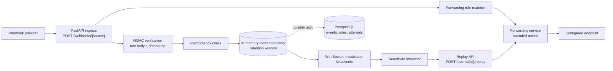

# Webhook Relay & Inspector

A standalone webhook relay for receiving events, inspecting payloads in real
time, replaying captured requests, and forwarding matching events to configured
endpoints.

## Architecture



## Project Layout

```text
backend/
  app/
    api/              FastAPI HTTP and WebSocket route factories
    core/             settings and HMAC signature helpers
    domain/           event, rule, attempt, and replay models
    repositories/     in-memory store plus PostgreSQL migration notes
    services/         forwarding, replay, and WebSocket fanout services
  tests/              focused stdlib unit tests
frontend/
  src/                React inspector UI
config/               sample forwarding rule config
docker-compose.yml    local multi-service runner
```

## Backend Setup

Prerequisites:
- Python 3.11+
- Node.js 20.19+ or 22.12+ for the Vite 7 frontend toolchain

```bash
cd /Users/nass/PycharmProjects/Portfolio/v0-robotics-portfolio-website/portfolio-projects/webhook-relay-inspector
cp .env.example .env
python -m venv .venv
source .venv/bin/activate
pip install -r backend/requirements.txt
uvicorn app.main:app --reload --app-dir backend
```

Send a local webhook:

```bash
curl -X POST http://localhost:8000/webhooks/stripe \
  -H "content-type: application/json" \
  -H "x-event-type: checkout.session.completed" \
  -d '{"id":"evt_demo","type":"checkout.session.completed","amount":4200}'
```

Run backend unit tests:

```bash
PYTHONPATH=backend python -m unittest discover backend/tests
```

## Frontend Setup

```bash
cd frontend
npm install
npm run dev
```

The inspector runs at `http://localhost:5173` and expects the backend at
`http://localhost:8000`.

## Docker Compose

```bash
cp .env.example .env
docker compose up --build
```

The optional PostgreSQL service is available behind a profile for persistence
adapter work:

```bash
docker compose --profile postgres up postgres
```

## API Surface

- `POST /webhooks/{source}` captures a webhook, verifies the signature when
  configured, stores the event, broadcasts it, and forwards it to matching rules.
- `GET /events` lists recent events from the retention window.
- `GET /events/{event_id}` returns event detail and delivery attempts.
- `POST /events/{event_id}/replay` replays an event to matching rules or an
  optional one-off `override_url`.
- `GET /rules`, `POST /rules`, `PATCH /rules/{rule_id}`, and
  `DELETE /rules/{rule_id}` manage forwarding rules.
- `WS /ws/events` streams event, replay, delivery, and rule updates.

## Design Notes

The backend stores exact raw request bytes so signature verification and replay
operate on the original payload, not a reformatted JSON body.

Forwarding carries `x-relay-event-id`, `x-relay-source`, `x-relay-event-type`,
and `x-relay-attempt` headers. Receivers can use those values for idempotency.
Retries are bounded inside the request worker so a slow receiver cannot trap the
service forever. The next step is a durable delivery queue with exponential
backoff and a dead-letter path.

Webhook retries are handled with idempotency keys from headers such as
`x-idempotency-key`, `x-webhook-id`, `x-github-delivery`, or a JSON `id`.
Duplicate deliveries return the original event instead of forwarding twice.

Event retention is count-based in memory, so events are lost on restart. The
repository methods and `backend/app/repositories/postgres_plan.py` show the
straight path to PostgreSQL tables for durable event history, replay audit, and
scheduled retention cleanup. The API also caps body size and event list limits
so local runs behave like a service with real operating boundaries.

Security defaults favor local development. Set `WEBHOOK_SIGNING_SECRET` to
require inbound HMAC verification, and set `RELAY_SIGNING_SECRET` to sign
outbound forwarded payloads.
